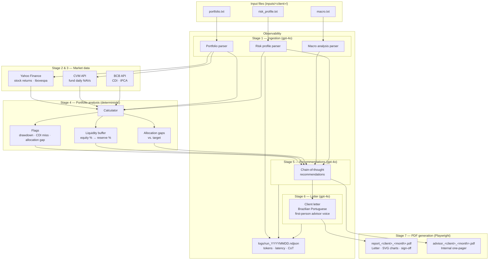

# XP AI Financial Advisor

POC of an AI-powered pipeline that generates personalized monthly investment reports for XP Investimentos clients. Given three plain-text input files, it produces two PDFs in under 60 seconds: a client-facing letter with charts and an internal advisor summary.

---

## How it works



**7-stage pipeline:**

| # | Stage | Description |
|---|-------|-------------|
| 1 | Ingestion | gpt-4o extracts structured data from the three input TXTs |
| 2 | Stock prices | Monthly returns fetched from Yahoo Finance |
| 3 | Fund NAVs & benchmarks | Daily NAVs from CVM public API; CDI, IPCA, Ibovespa |
| 4 | Portfolio analysis | Deterministic: allocation gaps, liquidity buffer, flags |
| 5 | Recommendations | gpt-4o generates investment recommendations with chain-of-thought |
| 6 | Client letter | gpt-4o writes a personalized letter in Brazilian Portuguese |
| 7 | PDF generation | Playwright (Chromium) renders two PDFs with inline SVG charts |

**Outputs:**
- `output/report_<client>_<month>.pdf` — client-facing report with letter and charts
- `output/advisor_<client>_<month>.pdf` — internal one-page advisor briefing

---

## Requirements

- Python 3.12+
- [uv](https://docs.astral.sh/uv/)
- OpenAI API key

---

## Setup

```bash
# Install dependencies
uv sync

# Install Chromium for Playwright (one-time)
uv run playwright install chromium

# Configure API key
echo "OPENAI_API_KEY=sk-..." > .env
```

---

## Usage

```bash
# Run with the default sample client (inputs/albert/)
uv run python main.py

# Run with a different client
uv run python main.py --input-dir inputs/joao

# Custom output directory
uv run python main.py --input-dir inputs/albert --output-dir /tmp/reports
```

---

## Input format

Each client folder under `inputs/` must contain three files exported from XP's systems.
Both `.pdf` and `.txt` are accepted per file — PDF takes priority if both exist, and mixing is allowed (e.g. `portfolio.pdf` + `macro.txt`).

```
inputs/
  albert/
    portfolio.pdf      # or portfolio.txt
    risk_profile.pdf   # or risk_profile.txt
    macro.pdf          # or macro.txt
```

The LLM parser handles free-form formatting — no rigid schema required. PDF files are processed with `pdfplumber`, which reconstructs table rows as pipe-delimited text before passing to the LLM.

---

## Regulatory note

This system does **not** recommend specific equity tickers for purchase. Buy/add recommendations describe investment theses and categories only (e.g. "increase allocation to post-fixed fixed income"). The human advisor makes specific stock selections in the client meeting. This constraint is enforced in the recommendations prompt per CVM guidelines.

---

## Project structure

```
main.py              # pipeline orchestration + CLI
src/
  ingestion/         # LLM-based parsers for the three input files
  analysis/          # deterministic calculator, flags, liquidity buffer
  llm/               # recommendations and letter writing (gpt-4o)
  prompts/           # system prompts for each LLM stage
  report/            # Playwright PDF generator, SVG charts, HTML templates
  observability/     # structured NDJSON logging per run
inputs/              # one folder per client
assets/              # static assets (logo)
```

---

## Observability

Every pipeline run writes a structured log to `logs/run_YYYYMMDD_HHMMSS.ndjson`. Each line is a JSON object capturing stage, model, token counts, latency, and the full chain-of-thought reasoning for LLM calls.

---

## Tests

```bash
uv run pytest tests/ -m "not integration" -q
```
